# rtkbox

Python utility for Raspberry Pi + Waveshare ZED-F9P RTK workflows.

## Requirements

- Python 3
- `str2str` installed and available in `PATH`
- Python packages:
  - `PyYAML`
  - `pyserial`

Install Python deps:

```bash
pip install -r requirements.txt
```

## Project layout

```text
zedf9p/
  rtkbox.py
  config.yaml
  config.example.yaml
  requirements.txt
  README.md
  old/
    ...
```

## First setup

Create your local config from the example file:

```bash
cp config.example.yaml config.yaml
```

Then edit `config.yaml` with your local values.

Git notes:

- `config.yaml` is ignored by git because it may contain local Wi-Fi and caster credentials
- `config.example.yaml` is the safe template to commit and share

## Modes

From the project directory:

```bash
python -m rtkbox base-local
python -m rtkbox base-ntrip
python -m rtkbox rover-local
python -m rtkbox rover-ntrip
python -m rtkbox receiver-bridge
python -m rtkbox record
python -m rtkbox nmea
python -m rtkbox portal
```

Optional config path:

```bash
python -m rtkbox --config config.yaml base-local
```

## Mode behavior

- `base-local`: serial receiver -> LAN TCP server (`tcpsvr://`)
- `base-ntrip`: serial receiver -> NTRIP caster (`ntrips://`)
- `rover-local`: LAN TCP client (`tcpcli://`) -> receiver serial
- `rover-ntrip`: NTRIP client (`ntrip://` or `ntripc://`) -> receiver serial
- `receiver-bridge`: bidirectional TCP bridge for remote `u-center` access to the receiver
- `record`: record raw UBX from the receiver directly on the Pi for PPP workflows
- `nmea`: print serial NMEA lines (starting with `$`) with auto reconnect
- `portal`: start a small local control page for config editing and mode start/stop

## Receiver bridge

Use `receiver-bridge` when you want `u-center` on a Windows PC to connect to the ZED-F9P over the network and send configuration commands back to the receiver.

Important:

- `receiver-bridge` is intended to use the receiver over the Pi USB connection
- for this mode to work reliably, the ZED-F9P HAT must also be connected to the Raspberry Pi by USB
- the Pi should see the receiver as `/dev/ttyACM0`

Run:

```bash
python -m rtkbox receiver-bridge
```

Or start it from the portal.

Default target:

```text
tcp://<pi-ip>:5011
```

Recommended config when the ZED-F9P is connected to the Pi by USB:

```yaml
receiver_bridge:
  serial_port: /dev/ttyACM0
  baud: 115200
  bind_host: ""
  port: 5011
```

In `u-center`:

1. Open `Receiver`
2. Open `Connection`
3. Choose `Network Connection`
4. Select `TCP`
5. Enter the Pi IP
6. Enter port `5011`

This mode uses `str2str -b 1` so traffic is relayed both ways:

- receiver -> PC
- PC -> receiver

## PPP survey workflow

This project now has a simple `record` mode for PPP capture. The practical PPP workflow with this setup is:

1. use `receiver-bridge` to access the ZED-F9P from `u-center`
2. enable raw satellite messages on the receiver
3. use `record` mode in the portal to save a long `.ubx` file on the Pi
4. convert the `.ubx` file to RINEX
5. submit the RINEX observation file to a PPP service
6. take the solved coordinates and program the base receiver as a fixed base

This section is based on SparkFun’s guide:

- https://learn.sparkfun.com/tutorials/how-to-build-a-diy-gnss-reference-station/gather-raw-gnss-data

### Step 1. Mount the antenna in a fixed location

The antenna location must be fixed not only during the PPP survey, but also during normal base use after you solve the coordinates. Put it somewhere with:

- a clear sky view
- a stable mount
- no plan to move it after installation

### Step 2. Start `receiver-bridge`

On the Pi:

```bash
python -m rtkbox receiver-bridge
```

Or start `receiver-bridge` from the portal.

Take note of the Pis IP in the console log.

Recommended config:

```yaml
receiver_bridge:
  serial_port: /dev/ttyACM0
  baud: 115200
  bind_host: ""
  port: 5011
```


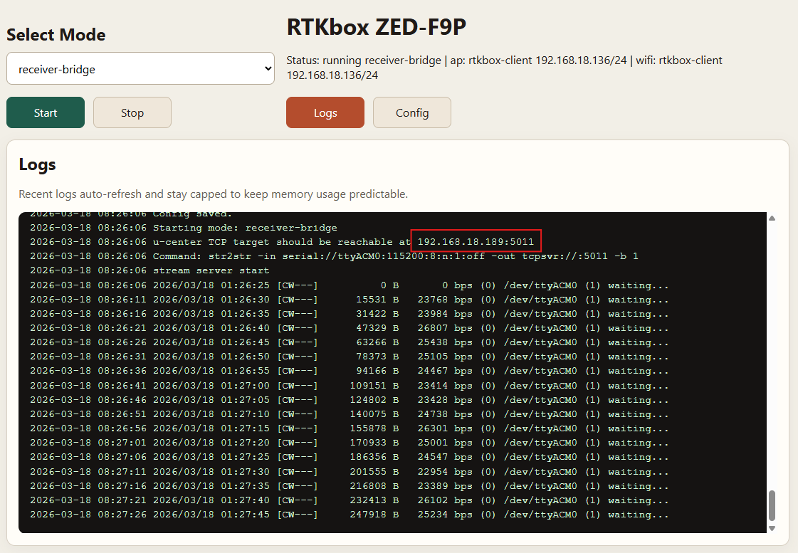

### Step 3. Connect `u-center` from Windows

In `u-center`:

1. Open `Receiver`
2. Open `Connection`
3. Choose `Network Connection`
4. Select `TCP`
5. Enter the Pi IP
6. Enter port `5011`

Verify that the receiver has a valid sky view before continuing.


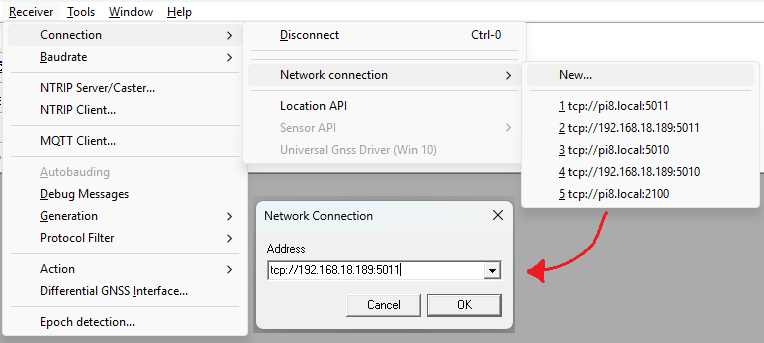

### Step 4. Enable raw logging messages

In `u-center`, open:

- `View -> Messages View`
- `UBX -> CFG -> MSG`

Enable these messages on the `USB` port with a rate of `1`:

- `UBX-RXM-RAWX`
- `UBX-RXM-SFRBX`

Optional but useful for normal monitoring:

- `UBX-NAV-PVT`
- `NMEA-GGA`

RAWX is binary, so you should verify it in the packet viewer, not the text console.

- `View -> Packet Console`


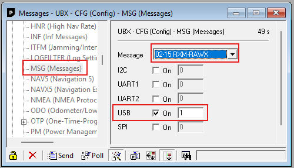
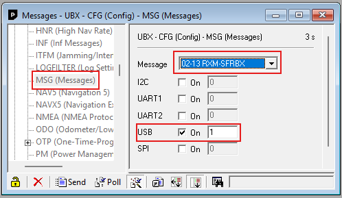
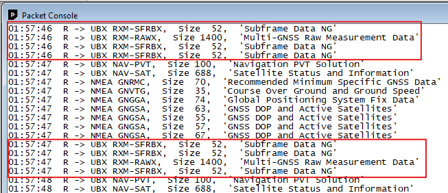

### Step 5. Record a `.ubx` file on the Pi

In the portal:

1. select `record`
2. click `Start`
3. let it run for the survey duration you want
4. watch the elapsed timer in the `Logs` view
5. click `Stop` when finished
6. download the finished `.ubx` file from the `Recordings` list in the same view

The file is stored on the Pi in the configured record output directory:

```yaml
record:
  serial_port: /dev/ttyACM0
  baud: 115200
  output_dir: recordings
```

Guidance:

- 6 hours is useful
- 24 hours is better
- keep the raw rate at `1Hz`
- expect about `300MB` for a 24 hour capture

Do not move the antenna during the recording.


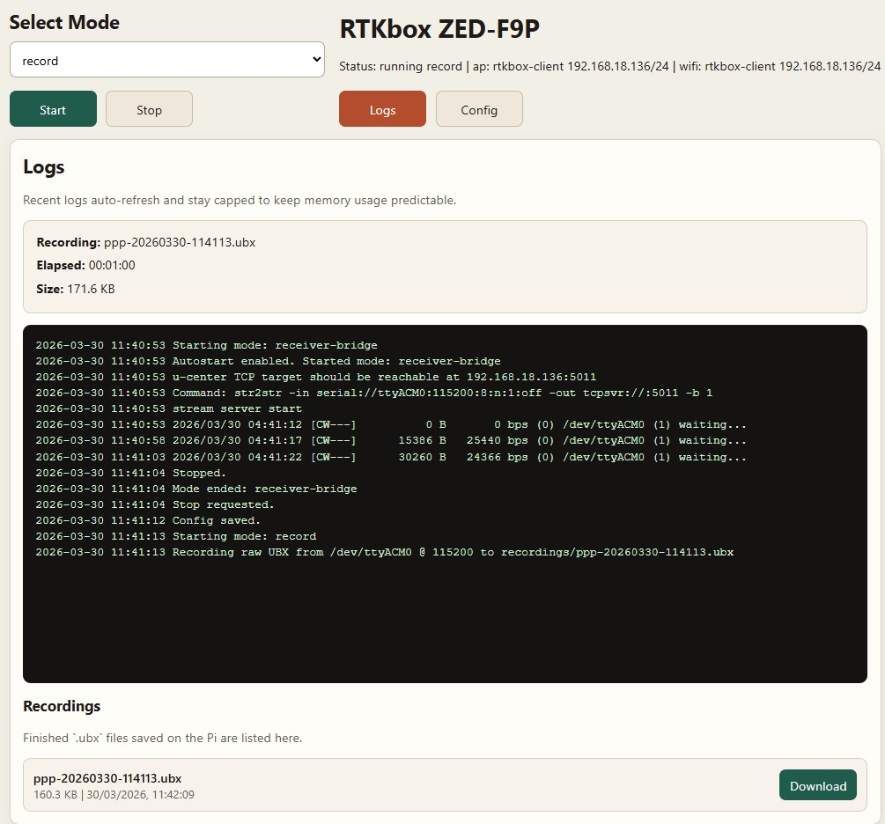

### Step 6. Convert the `.ubx` file to RINEX

Use `RTKCONV` from RTKLIB:

- RTKLIB download: https://rtkexplorer.com/downloads/rtklib-code/

1. open the recorded `.ubx` file
2. convert it to RINEX
3. keep the observation file (`.obs`)

If your recording is longer than needed, you can trim the observation window during conversion.


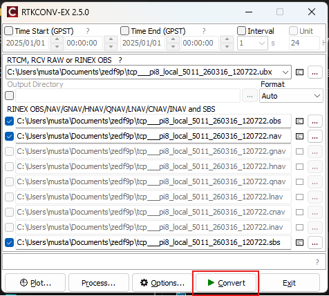

### Step 7. Submit the observation file to a PPP service

A practical choice is the Canadian CSRS-PPP service:

- CSRS-PPP: https://webapp.csrs-scrs.nrcan-rncan.gc.ca/geod/tools-outils/ppp.php?locale=en

Practical workflow:

1. zip the `.obs` file if needed
2. create or sign in to your CSRS account
3. choose the PPP upload page
4. select `ITRF`
5. upload the observation file
6. wait for the processing email
7. open the `Summary` link from the email

The result summary should give you the antenna coordinates in:

- geodetic format
- UTM format
- Cartesian format

For the ZED-F9P base setup, the most useful output is the Cartesian / ECEF position.


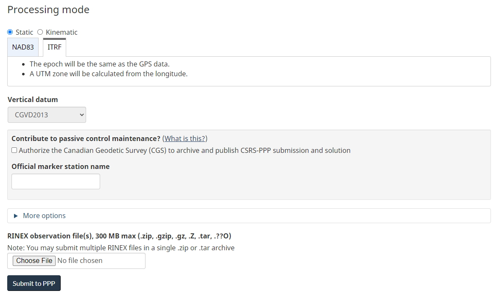
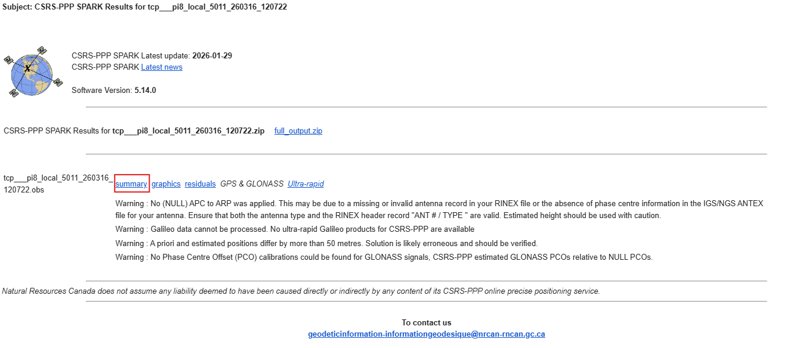
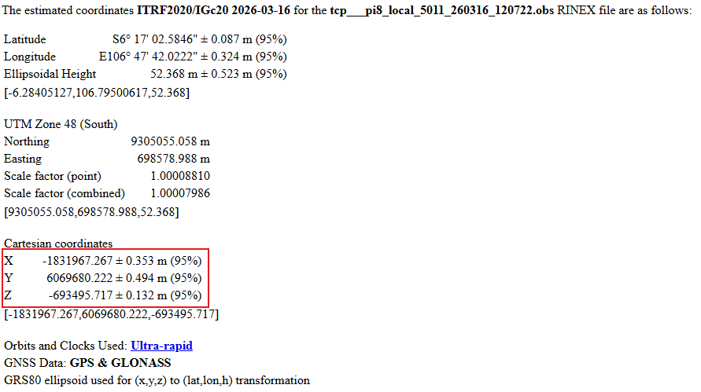

### Step 8. Program the fixed base coordinates back into the ZED-F9P

Once you have the solved coordinates:

1. return to `u-center`
2. go to `View -> Configuration View`
3. select TMODE3
4. enter the solved coordinates
5. save to receiver memory (`BBR/Flash`)

After that, the receiver can operate as a true fixed base and your normal `base-local` or `base-ntrip` workflows become the operational modes.


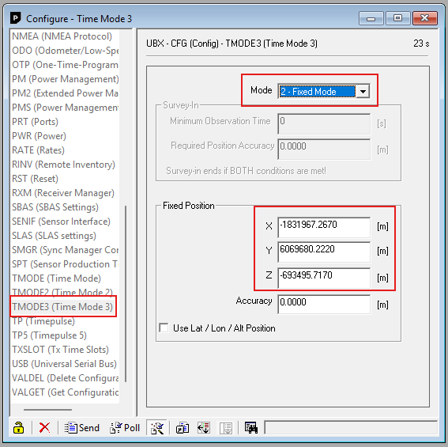

### PPP notes

- PPP is a one-time or occasional survey workflow, not your daily run mode
- use `receiver-bridge` for the survey/configuration phase
- use `base-local` or `base-ntrip` after the base coordinates are fixed
- if you change antenna position, redo the PPP survey

## Portal mode

Run:

```bash
python -m rtkbox portal
```

Then open from a device connected to the Pi AP:

```text
http://<pi-ip>:8080
```

The portal lets you:

- edit `config.yaml` through separate form fields
- choose one of the RTK/NMEA modes
- start or stop the selected mode
- view recent logs that auto-refresh in real time
- monitor active PPP recording time and current file size in `record` mode
- download finished `.ubx` recordings from the browser

This project provides the control page only. True captive portal redirect still depends on your Pi access-point setup such as `hostapd`, `dnsmasq`, and HTTP/DNS redirect rules.

## Product-style boot setup

This is the simplest way to make the box behave more like a product:

- the Pi starts its own hotspot on boot
- the portal runs automatically on boot
- the portal remembers the last selected RTK mode
- on the next boot, the portal can autostart that mode
- AP and client Wi-Fi are configured separately

### Step 1. Create the Pi hotspot once

This project includes a helper script. It reads the `ap` section from `config.yaml` by default:

```bash
sudo bash scripts/setup_hotspot.sh
```

What it does:

- creates a NetworkManager hotspot connection named `rtkbox-ap`
- uses `ap.interface`
- sets the Pi hotspot IP to `10.42.0.1`
- enables hotspot autoconnect on boot

After this, you should be able to connect to the Pi Wi-Fi SSID from `ap.ssid`.

You can still override values manually:

```bash
sudo bash scripts/setup_hotspot.sh RTKbox yourpassword wlan0 rtkbox-ap 10.42.0.1/24
```

### Step 2. Install the portal as a boot service

Copy the service file into `systemd`:

```bash
sudo cp systemd/rtkbox-portal.service /etc/systemd/system/rtkbox-portal.service
```

Reload `systemd`:

```bash
sudo systemctl daemon-reload
```

Enable the service on boot and start it now:

```bash
sudo systemctl enable --now rtkbox-portal.service
```

Check status:

```bash
sudo systemctl status rtkbox-portal.service
```

Follow live logs:

```bash
journalctl -u rtkbox-portal.service -f
```

### Step 3. Configure portal autostart behavior

In `config.yaml`:

```yaml
app:
  startup_mode: last
  remember_last_mode: true
  last_mode: ""
```

Meaning:

- `startup_mode: last` tells the portal to start the last used RTK mode on boot
- `remember_last_mode: true` updates `app.last_mode` whenever you start a mode
- `last_mode` is managed automatically by the app

### Step 4. Reboot test

```bash
sudo reboot
```

After reboot:

1. connect a phone or laptop to the Pi hotspot
2. open `http://10.42.0.1:8080`
3. confirm the portal loads
4. confirm the last selected mode starts automatically if `startup_mode` is enabled

### Step 5. Useful service commands

Restart the portal:

```bash
sudo systemctl restart rtkbox-portal.service
```

Stop the portal:

```bash
sudo systemctl stop rtkbox-portal.service
```

Disable boot autostart:

```bash
sudo systemctl disable rtkbox-portal.service
```

## Wi-Fi setup

The web UI can save Wi-Fi client settings and tell the Pi to join that network with `nmcli`.

Recommended interface layout:

- `ap.interface = wlan0`
- `wifi.interface = wlan1` when you add a second USB Wi-Fi adapter

Current single-radio fallback:

- `ap.interface = wlan0`
- `wifi.interface = wlan0`
- expect AP/client switching, not simultaneous use

To let the portal change networking, allow only `nmcli` through `sudo`.

Step 1. Create a sudoers rule

```bash
sudo visudo -f /etc/sudoers.d/rtkbox
```

Add this line:

```text
pi ALL=(root) NOPASSWD: /usr/bin/nmcli
```

Step 2. Fix the file permissions

```bash
sudo chmod 440 /etc/sudoers.d/rtkbox
```

Step 3. Validate the sudoers file

```bash
sudo visudo -c -f /etc/sudoers.d/rtkbox
```

Step 4. Test that `nmcli` works without a password prompt

```bash
sudo /usr/bin/nmcli device wifi list ifname wlan0
```

Step 5. Start the portal

```bash
python -m rtkbox portal
```

Step 6. Open the portal from a device connected to the Pi

```text
http://<pi-ip>:8080
```

Step 7. In the `Config` screen:

- set `wifi.interface` to the client interface you want to use
- choose an SSID from the dropdown
- enter the Wi-Fi password
- click `Save + Connect Wi-Fi`

Optional AP setup from the portal:

- edit the `Access Point` section
- click `Save + Apply AP`
- if you are reconfiguring the active AP, the portal may disconnect while the hotspot restarts

Important AP mode note:

- on a single-radio setup, enabling AP mode on `wlan0` disables normal Wi-Fi client use on that same interface
- if you enable AP mode, the Pi may stop using Wi-Fi for internet or LAN access
- if you want to keep configuring the Pi while enabling AP mode, the safest approach is to stay connected to the same Pi over Ethernet
- the cleaner long-term setup is `wlan0` for AP and `wlan1` for Wi-Fi client

Notes:

- The SSID dropdown comes from Wi-Fi networks currently visible to the Pi.
- If `wlan0` is being used for the AP and client at the same time, the portal may disconnect as soon as the Pi joins the target network.
- Scanning Wi-Fi and showing status use normal `nmcli`; only the actual connect action needs the `sudo` rule above.
- Access point apply also needs the same `sudo /usr/bin/nmcli` permission.

## Config reference

`serial`
- `port`: Serial device name/path for ZED-F9P. Example: `ttyAMA0` or `/dev/ttyAMA0`.
- `baud`: Serial baud rate. Example: `115200`.

`base_local` (used by `base-local`)
- `bind_host`: Host/IP to bind TCP server on Pi. `""` means all interfaces.
- `port`: TCP port exposed on LAN.
- `format`: Optional RTKLIB stream format suffix (usually leave empty).

`caster` (used by `base-ntrip`)
- `host`: NTRIP caster hostname.
- `port`: NTRIP caster port (usually `2101`).
- `mountpoint`: Mountpoint name to publish to.
- `user`: Optional username (empty if not required).
- `password`: Caster password.

`rover_local` (used by `rover-local`)
- `host`: IP/hostname of LAN correction source (TCP server).
- `port`: TCP port of LAN correction source.

`rover_ntrip` (used by `rover-ntrip`)
- `scheme`: `ntrip` or `ntripc` (RTKLIB client scheme).
- `host`: NTRIP caster hostname.
- `port`: NTRIP caster port.
- `mountpoint`: Mountpoint to subscribe to.
- `user`: Optional username.
- `password`: Password for mountpoint/caster.

`receiver_bridge` (used by `receiver-bridge`)
- `serial_port`: Receiver port used only for remote `u-center` access. Recommended: `/dev/ttyACM0`.
- `baud`: Baud rate for the bridge serial port.
- `bind_host`: Host/IP to bind the TCP bridge on the Pi. `""` means all interfaces.
- `port`: TCP port for `u-center` to connect to.

`app`
- `reconnect_delay`: Seconds to wait before reconnect/restart after errors.
- `portal_host`: HTTP bind address for the local control page.
- `portal_port`: HTTP port for the local control page.
- `startup_mode`: Mode to start automatically when the portal boots. Use `last` to resume the previous mode, or leave empty to disable autostart.
- `remember_last_mode`: If `true`, starting a mode updates `app.last_mode`.
- `last_mode`: Last started RTK mode. This is managed by the app.

`ap`
- `interface`: Wireless device used for the management hotspot. Recommended: `wlan0`.
- `connection_name`: Saved NetworkManager hotspot profile name.
- `ssid`: Hotspot SSID devices connect to.
- `password`: Hotspot password. Must be at least 8 characters.
- `address`: Hotspot IP/subnet, for example `10.42.0.1/24`.

`wifi`
- `interface`: Wireless device used for client connection. Use `wlan1` if you add a second Wi-Fi adapter, otherwise `wlan0`.
- `connection_name`: Saved NetworkManager connection name, for example `rtkbox-client`.
- `ssid`: Target Wi-Fi network name.
- `password`: Target Wi-Fi password.
